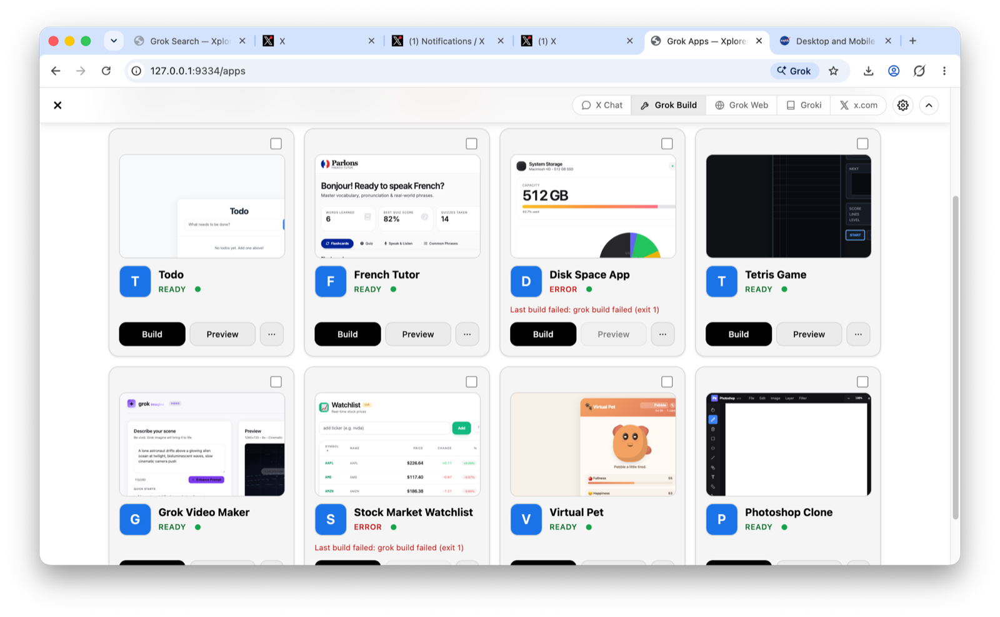
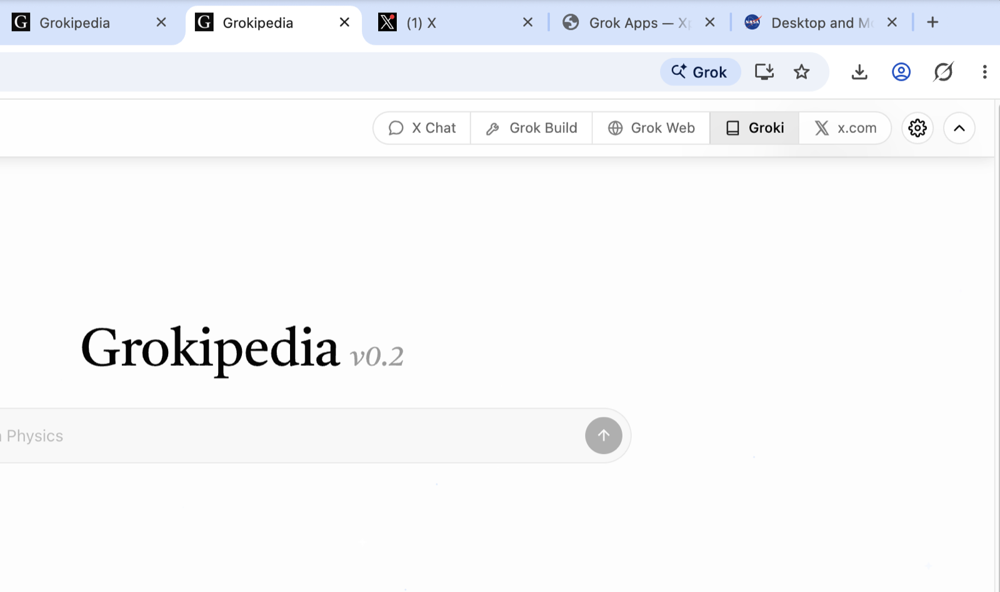
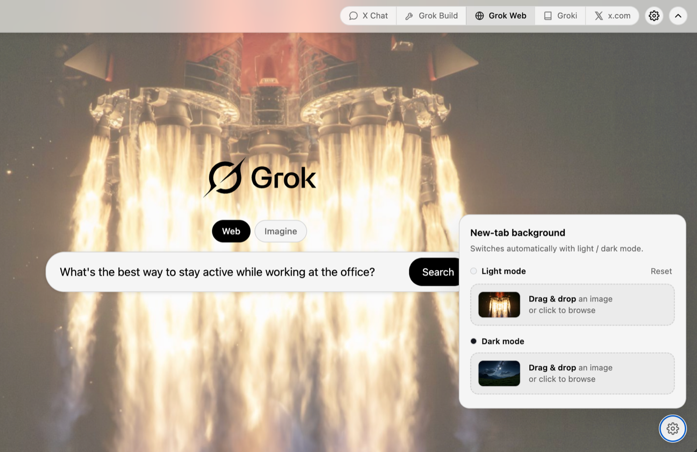

<p align="center">
  
</p>

<h1 align="center">Xplorer</h1>

<p align="center"><b>The browser with Grok in every tab.</b></p>

<p align="center">
  Search, chat, build apps, and control tabs — with Grok built into every page.<br>
  No extensions, no copy‑paste. Just ask.
</p>

<p align="center">
  <picture>
    <source media="(prefers-color-scheme: dark)" srcset="site/assets/screenshot-hero-dark.png">
    
  </picture>
</p>

Xplorer is a **full web browser** — a fork of Chromium (the real thing: Blink, V8,
the multiprocess sandbox, the whole content layer) modified at the C++ source level
to be **AI‑native**. Every site works, every extension runs, with the sandboxing you
expect. Grok is added at the core, not bolted on as a tab. macOS (Apple Silicon).

---

## Features

> Real, shipping features — not a chat box in a sidebar.

- ✦ **The "Grok it" button** — a floating Grok button on every page. Summarize the long
  read, fact‑check the claims ("Is this true?"), explain it, or analyze it — your page is
  handed to Grok with one click.
- ⚒ **Grok Build** — describe an app in plain words and Grok writes it, then runs it live
  in a tab. Watch it build, then keep iterating just by chatting — "make the header
  sticky," and it does.
- ▦ **Apps & conversations** — every build gets its own folder and a dedicated
  conversation. Browse the gallery, filter by status, rename, duplicate, export to a zip,
  or relaunch — your apps and chats stay organized.
- ⌕ **Grok Search home** — new tabs open Grok Search. Type a query and it runs on grok.com
  with full context — Web and Imagine modes built in. Make the backdrop yours: a solid
  color, gradient, animated star field, or your own image per light/dark mode.
- ⊞ **One bar for all of Grok** — a unified toolbar across Grok Build, Grok Web, Imagine,
  Groki, and X — on Xplorer's own pages and as an overlay on grok.com, x.com, and
  Grokipedia.
- ⚡ **Agent‑ready & MCP** — Xplorer ships as an MCP server with an always‑on local
  gateway, so agents like Grok, Claude, and Cursor can drive the browser natively — tabs,
  navigation, clicks, screenshots.

### Build apps by describing them

Type what you want on the Apps page and Grok writes the files for you — you watch it think
and build in real time, with the finished app running live in a preview beside the chat.
Don't like something? Just tell Grok, and it edits the app in place.

<p align="center"></p>

### One toolbar for all of Grok

<p align="center"></p>

### Your new tab, your backdrop

Every new tab opens Grok Search. Pick a background per light/dark mode — a color, gradient,
animated stars, the built‑in landscape, or your own image by drag‑and‑drop — and Xplorer
remembers it, switching automatically with your theme.

<p align="center"></p>

---

## Built for agents, too

Xplorer runs an **always‑on local gateway** and ships as an **MCP server** — so any agent
can drive it, with no launch flags and no setup dance.

### Why

Stock Chrome only exposes the Chrome DevTools Protocol (CDP) when launched with
`--remote-debugging-port`, and treats automation as a second‑class debug mode: a
`navigator.webdriver` flag, an "automation" banner, and a brittle CDP session dance before
you can do anything. Agents deserve better — a browser that is controllable natively, fast,
private, and always ready. And people deserve Grok woven into browsing, not stapled on in a
sidebar. Xplorer is both at once.

### How

Xplorer bakes agent access into the browser process itself:

1. **AgentGateway service** (`src/chrome/browser/agent_gateway/`) — a component compiled
   into the browser process that starts automatically at profile load. It exposes:
   - the full **CDP** over `ws://127.0.0.1:9333` (Playwright / Puppeteer compatible)
   - a higher‑level **Agent API** on `http://127.0.0.1:9334` with the primitives agents
     actually want — `navigate`, `text` (readability‑style extraction), `axtree`
     (accessibility‑tree snapshot for grounding), `click`, `type`, `press`, `screenshot`,
     `eval`, `tabs` — each one round trip instead of a CDP session dance.
2. **First‑class, not intruder** — no automation banner and no `navigator.webdriver`
   poisoning for gateway sessions. Agents drive tabs while Xplorer is in the background;
   hidden tabs stay live.
3. **Local & private** — the gateway binds to `127.0.0.1` and is token‑gated. Discovery is
   a single file, `~/.xplorer/gateway.json`.
4. **Grok‑native UI** — a companion layer (toolbar, Grok Search new tab, the Apps builder)
   is served from the local gateway and overlaid on Grok's own sites, and Grok is wired in
   as the default search engine — all in the C++ layer.
5. **Apps system** — "Grok Build" runs the `grok` CLI as a subprocess inside a per‑app
   folder; it writes static HTML/CSS/JS, and the gateway hosts the result at `/run/<id>/`.
   No bundler, no deploy step.

See [`docs/AGENT_API.md`](docs/AGENT_API.md) for the full reference.

### Connect an agent

Discover the gateway, then talk to it (loopback‑only, token‑gated):

```jsonc
// ~/.xplorer/gateway.json
{ "url": "http://127.0.0.1:9334", "cdp_url": "ws://127.0.0.1:9333", "token": "…" }
// Send  Authorization: Bearer <token>  on every request.
```

Python SDK (`sdk/xplorer_sdk.py`, stdlib‑only):

```python
from xplorer_sdk import Browser

b = Browser()                       # auto-discovers the running browser
tab = b.tabs()[0]["id"]             # tab ids look like "12:0"
b.navigate(tab, "https://example.com")
print(b.text(tab))                  # clean, readable text — one round trip
b.click(tab, "a#more")
tree = b.axtree(tab)                # accessibility tree for grounding
shot = b.screenshot(tab)            # PNG bytes — works on background tabs
```

Quick check from a shell:

```sh
TOKEN=$(python3 -c "import json,os;print(json.load(open(os.path.expanduser('~/.xplorer/gateway.json')))['token'])")
curl -s -H "Authorization: Bearer $TOKEN" http://127.0.0.1:9334/tabs
```

**MCP (recommended):** register `sdk/xplorer_mcp.py` (stdio, stdlib‑only) and your agent gets
native browser tools — `xplorer_tabs`, `xplorer_navigate`, `xplorer_read_text`, `xplorer_click`,
`xplorer_type`, `xplorer_press`, `xplorer_screenshot`, `xplorer_eval`. It auto‑discovers the
running browser via `~/.xplorer/gateway.json`.

**Raw CDP:** point Playwright / Puppeteer at `ws://127.0.0.1:9333` — no flags.

---

## Install

Download the latest build for macOS (Apple Silicon) from
[**Releases**](https://github.com/daniel-farina/xplorer/releases), or build from source.

## Build from source

This is an *overlay repo*: Chromium is too large to vendor, so Xplorer is an upstream
Chromium checkout with `xplorer/` applied on top.

```sh
./xplorer/apply.sh   # copy src/, apply patches onto ../chromium/src
./xplorer/build.sh   # gn gen out/xplorer && autoninja -C out/xplorer chrome
```

Requires: macOS + Xcode, `depot_tools` on PATH, ~80 GB disk, and several hours for the
first build.

## Repo layout

```
xplorer/
  patches/    string-patches applied to the chromium tree
  src/        new files copied verbatim into the tree (agent_gateway/, grok_companion/)
  companion/  Grok-native UI served from the gateway (toolbar, search, apps)
  sdk/        Python client SDK + MCP server for agents
  docs/       agent API reference
  site/       landing page
  build/      release build configuration (args.gn)
  apply.sh    copies src/, applies patches/
  build.sh    gn gen + autoninja
```
