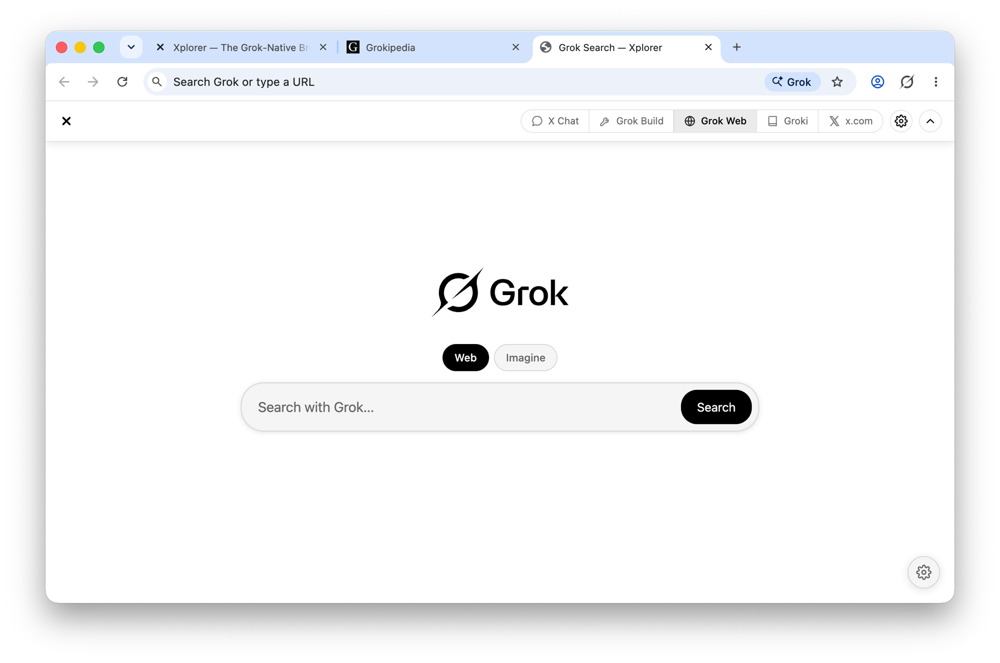
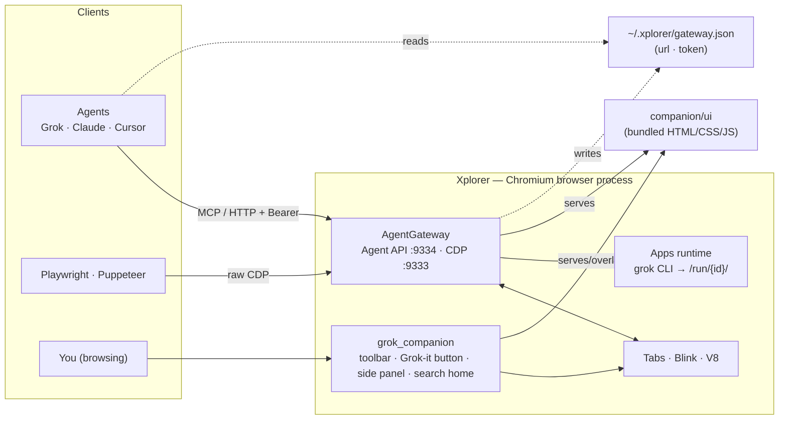

<p align="center">
  
</p>

<h1 align="center">Xplor</h1>

<p align="center"><b>The agentic browser with Grok in every tab.</b></p>

<p align="center">
  Search, chat, build apps, and drive the web — with Grok woven into every page.<br>
  Tabs organize themselves, agents run on a schedule or in the background, and an<br>
  agentic Grok side panel rides along. No extensions, no copy‑paste. Just ask.
</p>

<p align="center">
  
  
  
  <a href="https://github.com/daniel-farina/xplorer/releases"></a>
  <a href="https://github.com/daniel-farina/xplorer/stargazers"></a>
  <a href="https://daniel-farina.github.io/xplorer/"></a>
</p>

<p align="center">
  <picture>
    <source media="(prefers-color-scheme: dark)" srcset="site/assets/screenshot-hero-dark.png">
    
  </picture>
</p>

Xplor is a **full web browser** — a fork of Chromium (the real thing: Blink, V8, the
multiprocess sandbox, the whole content layer) modified at the C++ source level to be
**AI‑native**. Every site works, every extension runs, with the sandboxing you expect.
Grok is woven in at the core, not bolted on: an agentic side panel, auto‑organized tabs,
and agents that run on a schedule or quietly in the background. The same engine exposes a
clean local API and a built‑in MCP gateway, so **any agent can drive the browser** — no
launch flags, no setup dance — and the app keeps itself current with in‑app auto‑update.

> **Platform:** macOS — Apple Silicon (arm64) and Intel (x86_64) — **Windows x64**, and **Linux x64**. [Download the latest release](https://github.com/daniel-farina/xplorer/releases) or [build from source](#develop-locally).

---

## Contents

- [Features](#features)
- [How it works](#how-it-works)
- [Architecture](#architecture)
- [For agents & developers](#for-agents--developers)
- [Download](#download)
- [Develop locally](#develop-locally)
- [Project layout](#project-layout)
- [Contributing](#contributing)
- [Star history](#star-history)
- [License](#license)

---

## Features

Real, shipping features — not a chat box in a sidebar.

- **The "Grok it" button** — a floating Grok button on every page. Summarize the long
  read, fact‑check a claim ("Is this true?"), explain it, or analyze it — the page is
  handed to Grok in one click.
- **Grok Build** — describe an app in plain words and Grok writes it, then runs it live in
  a tab. Watch it build, then keep iterating just by chatting ("make the header sticky")
  — it edits the app in place, beside a live preview.
- **Apps & conversations** — every build gets its own folder and a dedicated conversation.
  Browse the gallery, filter by status, rename, duplicate, export to a zip, or relaunch —
  your apps and chats stay organized.
- **Grok Search home** — new tabs open Grok Search (Web and Imagine modes built in). Make
  the backdrop yours per light/dark mode: a solid color, a gradient, an animated star
  field, the built‑in landscape, or your own image by drag‑and‑drop.
- **One bar for all of Grok** — a unified toolbar across Grok Build, Grok Web, Imagine,
  Groki, and X — on Xplor's own pages and as an overlay on grok.com, x.com, and
  Grokipedia.
- **Agent‑ready & MCP** — an always‑on local gateway and a bundled MCP server, so agents
  like Grok, Claude, and Cursor can drive the browser natively: tabs, navigation, clicks,
  text extraction, screenshots.

See it in motion on the [website](https://daniel-farina.github.io/xplorer/).

---

## How it works

Stock Chrome only exposes the Chrome DevTools Protocol (CDP) when launched with
`--remote-debugging-port`, and treats automation as a second‑class debug mode — a
`navigator.webdriver` flag, an "automation" banner, and a brittle session dance before you
can do anything. Agents deserve better, and people deserve Grok woven into browsing rather
than stapled on. Xplor is both at once, achieved with a small set of source‑level
additions to Chromium:

1. **AgentGateway** (`src/chrome/browser/agent_gateway/`) — a component compiled into the
   browser process that starts automatically at profile load. It serves the full CDP on
   `ws://127.0.0.1:9333` and a higher‑level HTTP **Agent API** on `http://127.0.0.1:9334`.
2. **First‑class, not intruder** — no automation banner and no `navigator.webdriver`
   poisoning for gateway sessions. Agents drive tabs while Xplor is in the background;
   hidden tabs stay live and screenshottable.
3. **Local & private** — the gateway binds to `127.0.0.1` and is token‑gated. Discovery is
   a single file: `~/.xplorer/gateway.json`.
4. **Grok‑native UI** (`src/chrome/browser/grok_companion/`) — the toolbar, the Grok Search
   new tab, the Apps builder, the "Grok it" button, and the side panel. The UI is plain
   HTML/CSS/JS served by the gateway and overlaid on Grok's own sites; Grok is wired in as
   the default search engine.
5. **Apps system** — "Grok Build" runs the `grok` CLI as a subprocess inside a per‑app
   folder; it writes static HTML/CSS/JS, and the gateway hosts the result at `/run/<id>/`.
   No bundler, no deploy step.

---

## Architecture

Xplor is an **overlay** on Chromium: Chromium is too large to vendor, so the repo is a
thin layer (`src/` new files + `patches/` source edits + `companion/` UI) applied on top of
an upstream checkout. Keeping the footprint small is deliberate — it's what makes a fork
rebaseable against a codebase that ships every ~4 weeks.



---

## For agents & developers

The gateway is the integration surface. Discover it, then talk to it (loopback‑only,
token‑gated):

```jsonc
// ~/.xplorer/gateway.json — written at startup
{ "url": "http://127.0.0.1:9334", "cdp_url": "ws://127.0.0.1:9333", "token": "…" }
// Send  Authorization: Bearer <token>  on every Agent API request.
```

**Python SDK** (`sdk/xplorer_sdk.py`, stdlib‑only, auto‑discovers the running browser):

```python
from xplorer_sdk import Browser

b = Browser()
tab = b.tabs()[0]["id"]              # tab ids look like "12:0"
b.navigate(tab, "https://example.com")
print(b.text(tab))                   # clean, readable text — one round trip
b.click(tab, "a#more")
tree = b.axtree(tab)                 # accessibility tree for grounding
shot = b.screenshot(tab)             # PNG bytes — works on background tabs
```

**Shell:**

```sh
TOKEN=$(python3 -c "import json,os;print(json.load(open(os.path.expanduser('~/.xplorer/gateway.json')))['token'])")
curl -s -H "Authorization: Bearer $TOKEN" http://127.0.0.1:9334/tabs
```

**MCP (recommended):** register `sdk/xplorer_mcp.py` (stdio, stdlib‑only) and your agent
gets native tools — `xplorer_tabs`, `xplorer_navigate`, `xplorer_read_text`,
`xplorer_click`, `xplorer_type`, `xplorer_press`, `xplorer_screenshot`, `xplorer_eval`.

**Raw CDP:** point Playwright or Puppeteer at `ws://127.0.0.1:9333` — no flags.

Full endpoint reference: [`docs/AGENT_API.md`](docs/AGENT_API.md).

---

## Download

Latest builds — these links always point at the **newest release**. macOS builds
are Developer ID–signed & notarized (open without Gatekeeper warnings); the
Windows build isn't code‑signed yet (SmartScreen may warn — choose **More info →
Run anyway**, and allow it in Defender if prompted).

| Platform | Direct download |
|----------|-----------------|
| **macOS — Apple Silicon** (M1/M2/M3/M4) | [**Xplorer-macos-arm64.dmg**](https://github.com/daniel-farina/xplorer/releases/latest/download/Xplorer-macos-arm64.dmg) · [.zip](https://github.com/daniel-farina/xplorer/releases/latest/download/Xplorer-macos-arm64.zip) |
| **macOS — Intel** | [**Xplorer-macos-x86_64.dmg**](https://github.com/daniel-farina/xplorer/releases/latest/download/Xplorer-macos-x86_64.dmg) · [.zip](https://github.com/daniel-farina/xplorer/releases/latest/download/Xplorer-macos-x86_64.zip) |
| **Windows x64** (10/11) | [**Xplorer-windows-x64-installer.exe**](https://github.com/daniel-farina/xplorer/releases/latest/download/Xplorer-windows-x64-installer.exe) · [.zip](https://github.com/daniel-farina/xplorer/releases/latest/download/Xplorer-windows-x64.zip) |
| **Linux x64** (Ubuntu 22.04+ / Debian 12+) | [**Xplorer-linux-x64.tar.gz**](https://github.com/daniel-farina/xplorer/releases/latest/download/Xplorer-linux-x64.tar.gz) · [checksum](https://github.com/daniel-farina/xplorer/releases/latest/download/Xplorer-linux-x64.sha256.txt) |

macOS: open the DMG and drag **Xplorer** to Applications. Windows: run the
**installer** (`Xplorer-windows-x64-installer.exe` — creates Start‑menu & Desktop
shortcuts), or grab the portable **`.zip`** and run **`Xplorer\Xplorer.exe`**.

### Linux install

Portable **x86_64** build — no installer yet. Tested on Ubuntu 24.04; Ubuntu 22.04+
and Debian 12+ should work. **Requires an x86_64 CPU** (Intel/AMD). ARM64 Linux
(Raspberry Pi, Apple Silicon VMs) will fail with `Exec format error`.

**Quick install** — copy‑paste the whole block:

```sh
cd ~/Downloads   # or wherever you want it
curl -LO https://github.com/daniel-farina/xplorer/releases/latest/download/Xplorer-linux-x64.tar.gz
curl -LO https://github.com/daniel-farina/xplorer/releases/latest/download/Xplorer-linux-x64.sha256.txt
sha256sum -c Xplorer-linux-x64.sha256.txt      # prints "...tar.gz: OK"
tar -xzf Xplorer-linux-x64.tar.gz
cd Xplorer-linux-x64
./xplorer
```

The `xplorer` wrapper launches the real `chrome` binary beside it. On first start
the Agent Gateway writes `~/.xplorer/gateway.json` and listens on `127.0.0.1:9334`
(confirm with `cat ~/.xplorer/gateway.json`).

**Optional — add a menu shortcut** (while still inside `Xplorer-linux-x64/`):

```sh
sed "s|@@INSTALL_DIR@@|$PWD|g" xplorer.desktop > ~/.local/share/applications/xplorer.desktop
```

**Sandbox note:** the tarball ships without the SUID sandbox bit (tar cannot
preserve it). Modern kernels use the unprivileged namespace sandbox and need no
extra setup. If Chromium warns about the sandbox on your distro, either pass
`--no-sandbox` or run:

```sh
sudo chown root:root chrome_sandbox && sudo chmod 4755 chrome_sandbox
```

All releases + checksums on the
[Releases](https://github.com/daniel-farina/xplorer/releases) page, or
[build it yourself](#develop-locally).

---

## Develop locally

Xplor builds on top of a normal Chromium checkout that lives *next to* this repo:

```
chromium/src        # upstream Chromium (fetched separately)
xplorer/            # this repo — applied on top
```

**Prerequisites (one‑time):** macOS + full Xcode on Apple Silicon, ~100 GB free disk, and
`depot_tools` on your `PATH`.

```sh
# 1. depot_tools
git clone https://chromium.googlesource.com/chromium/tools/depot_tools.git
export PATH="$PWD/depot_tools:$PATH"

# 2. Chromium source (the long download), as a sibling of this repo
mkdir chromium && cd chromium
fetch --no-history chromium
cd src && gclient runhooks && cd ../..

# 3. this repo, beside chromium/
git clone https://github.com/daniel-farina/xplorer.git
```

**Build:**

```sh
./xplorer/apply.sh    # copy src/ + companion UI + icons, apply source patches
./xplorer/build.sh    # Apple Silicon: gn gen out/aether + autoninja
./xplorer/build.sh ./chromium/src x64   # Intel: out/aether_x64 (cross-builds on M-series)
./xplorer/build.sh ./chromium/src linux # Linux x64: out/aether_linux
```

**Linux** from source (Ubuntu 24.04+ recommended): same overlay, then
`./build/install-build-deps.sh --no-prompt`, `gclient runhooks`, and
`./scripts/package_linux.sh` to produce `dist/Xplorer-linux-x64.tar.gz`.
See `scripts/linux_buildbox_bootstrap.sh` for an unattended remote-build script.

The first build takes a few hours (it compiles all of Chromium locally). After that,
**incremental rebuilds are minutes** — edit a file and re‑run `autoninja -C out/aether chrome`.
Companion UI files (`companion/ui/*.html|css|js`) are served live from disk, so UI tweaks
don't even need a rebuild.

Run it:

```sh
open ./chromium/src/out/aether/Xplorer.app
cat ~/.xplorer/gateway.json     # confirm the gateway came up
```

**Windows** builds the same overlay with the Windows toolchain — PowerShell
scripts mirror the shell ones:

```powershell
.\xplorer\apply.ps1 -Src C:\src\chromium\src   # copy src/ + .ico icon, apply patches
.\xplorer\build.ps1 -Src C:\src\chromium\src   # gn gen out\xplorer_x64 + autoninja
```

Prerequisites differ (Visual Studio 2022 + Windows SDK, `depot_tools` with
`DEPOT_TOOLS_WIN_TOOLCHAIN=0`, ~150 GB disk). The output is a flat
`out\xplorer_x64\chrome.exe` rather than a `.app` bundle.

Releasing is documented per platform: [`RELEASE.md`](RELEASE.md) (macOS — signing,
notarization, packaging) and [`RELEASE.windows.md`](RELEASE.windows.md) (Windows —
portable zip / `mini_installer`, optional Authenticode signing).

---

## Project layout

```
xplorer/
  src/         new C++ files copied into the Chromium tree
               (agent_gateway/, grok_companion/)
  patches/     idempotent, anchor‑based source patches (apply_integration.py)
  companion/   Grok‑native UI served by the gateway (toolbar, search, apps)
  sdk/         Python client SDK + MCP server for agents
  docs/        Agent API reference
  site/        landing page (published to GitHub Pages)
  build/       release build configuration (args.gn)
  branding/    app icon, vector marks
  apply.sh / apply.ps1   overlay onto ../chromium/src (macOS / Windows)
  build.sh / build.ps1   gn gen + autoninja (macOS / Windows)
  RELEASE.md / RELEASE.windows.md   build / package / publish runbooks
```

---

## Contributing

Contributions are welcome. A few things that keep this fork healthy:

- **Keep the overlay thin.** Prefer adding code under `src/chrome/browser/agent_gateway/`
  or `src/chrome/browser/grok_companion/` over editing Chromium files. Every edit to an
  upstream file is something that must be re‑applied each time Chromium is re‑synced.
- **Patch via anchors, not diffs.** Source edits live in `patches/apply_integration.py`,
  which inserts/replaces relative to a unique anchor string and is idempotent (safe to
  re‑run). If an anchor moves upstream, the patcher fails loudly — update the anchor.
- **UI is just files.** The companion UI is plain HTML/CSS/JS in `companion/ui/`, served
  live from disk in dev — no build step, fast iteration.
- **Test the real thing.** After `apply.sh` + `build.sh`, exercise changes against the
  running browser (the SDK in `sdk/` is handy for scripted checks).

Open an issue to discuss larger changes first, and keep PRs focused.

---

## Star history

If Xplor is useful to you, please **[give it a ⭐ on GitHub](https://github.com/daniel-farina/xplorer)** — it's the simplest way to support the project and helps more people discover it.

<p align="center">
  <a href="https://star-history.com/#daniel-farina/xplorer&Date">
    <picture>
      <source media="(prefers-color-scheme: dark)" srcset="https://api.star-history.com/svg?repos=daniel-farina/xplorer&type=Date&theme=dark">
      <source media="(prefers-color-scheme: light)" srcset="https://api.star-history.com/svg?repos=daniel-farina/xplorer&type=Date">
      
    </picture>
  </a>
</p>

---

## License

Xplor is a derivative of [Chromium](https://www.chromium.org/), which is distributed
under a BSD‑3‑Clause license; Chromium's own license and third‑party notices continue to
apply to the browser. Licensing for the Xplor overlay in this repository is set by the
project owner — see the repository for terms.
